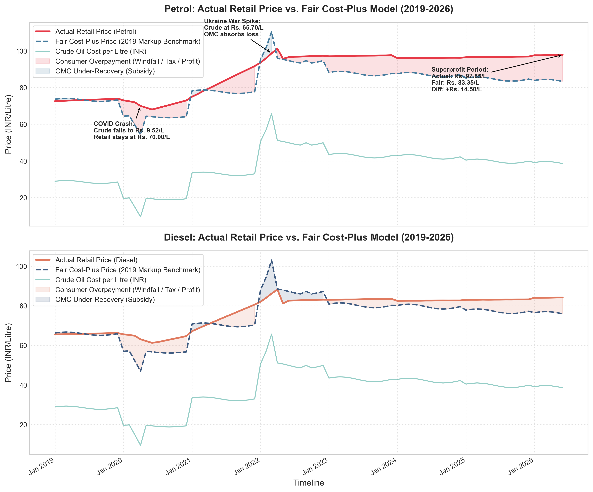
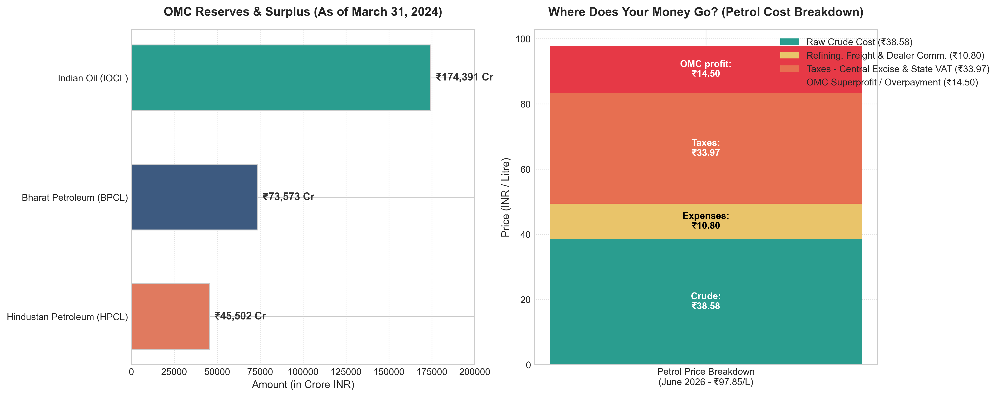
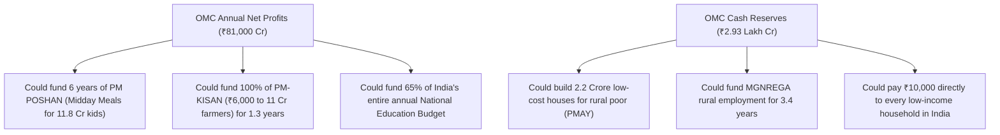

# 🛑 Special Diagnostic Report: Indian Fuel Price Asymmetry (2019–2026)
### *Analyzing "Rockets & Feathers" pricing, OMC Windfalls, and the Fair Price Model for the Indian Consumer*

---

## Executive Summary
This report analyzes the relationship between global crude oil prices and domestic retail prices of petrol and diesel in India from **January 2019 to June 2026**. 

The findings confirm the existence of a severe **"Rockets and Feathers"** pricing asymmetry: **retail fuel prices shoot up like rockets when international crude oil spikes, but drift down slowly like feathers (or remain completely frozen) when crude prices crash.** 

Over this 7.5-year period, oil marketing companies (OMCs) and the government have systemically structured pricing to transfer the burden of high oil costs to the citizen, while capturing the windfalls of low crude prices to subsidize government balance sheets and shore up corporate balance sheets.

---

## 📊 Visualizing the Pricing Gap (2019–2026)

The chart below plots the actual retail prices of petrol and diesel against a **Fair Cost-Plus Model** (constructed using the stable pre-COVID 2019 baseline markup). 

*   **Red / Orange Area (Overpayment):** Indicates the period where the domestic consumer is overpaying relative to crude costs and normal markups.
*   **Blue Area (Under-Recovery):** Indicates the short windows where retail prices were kept below crude parity (temporary subsidy/freeze).

---

## ⚖️ The "Fair Cost-Plus" Pricing Model
To calculate how much customers *should* be paying, we establish a **Fair Cost-Plus Model** using the **2019 pre-COVID baseline**. 

During 2019, fuel pricing was relatively stable, and markups covered refining margins, logistics, dealer commissions, state VAT, central excise, and a healthy profit margin for OMCs:
*   **Petrol Fair Markup Benchmark:** **`₹44.77 per litre`** above the crude oil cost.
*   **Diesel Fair Markup Benchmark:** **`₹37.38 per litre`** above the crude oil cost.

### The Pricing Formula:
$$\text{Fair Retail Price} = \left( \frac{\text{Crude Oil USD per Barrel} \times \text{USD/INR Exchange Rate}}{159} \right) + \text{Fair Markup Benchmark}$$

---

## 🔍 The Three Phases of Price Manipulation (2019–2026)

### 📈 Phase 1: The COVID-19 Windfall Capture (Early 2020)
In April 2020, global lockdowns caused international crude prices to collapse to **`$20.35 per barrel`**, bringing the raw cost of crude oil down to just **`₹9.52 per litre`**.
*   **What should have happened:** Retail petrol should have dropped to **`₹54.29 / litre`** (`₹9.52` crude + `₹44.77` fair markup).
*   **What actually happened:** Retail petrol was frozen at **`₹70.00 / litre`**. 
*   **The Discrepancy:** The markup spiked to **`₹60.48 / litre`**, leading to a **consumer overpayment of `₹15.72 per litre`** (and `₹16.20 per litre` for diesel).
*   **Who took the profit?** The Central Government raised excise duties to record highs (from ₹19.98 to ₹32.98/litre on petrol) to swallow 100% of the price drop. The public received zero relief during a global economic crisis.

---

### 📉 Phase 2: The Under-Recovery "Shield" (Early 2022)
Following the outbreak of the Russia-Ukraine War, crude oil spiked to **`$132.38 per barrel`** (March 2022), driving the raw cost of crude to **`₹65.70 per litre`**.
*   **What should have happened:** Retail petrol should have risen to **`₹110.47 / litre`** to maintain margins.
*   **What actually happened:** Retail petrol was kept frozen at **`₹98.65 / litre`** to avoid public backlash and control inflation.
*   **The Discrepancy:** The markup fell to `₹32.95 / litre`—a **deficit of `₹11.81 per litre`** for petrol and `₹16.91 per litre` for diesel.
*   **Who bore the burden?** OMCs incurred heavy "under-recoveries" (accounting losses) on direct retail sales. 

---

### 💰 Phase 3: The Superprofit Recapture Era (2023–2026)
This is where the moral hazard lies. Once crude oil stabilized and dropped back to **`$70–$80 per barrel`**, retail prices were kept frozen near all-time peak war levels.
*   **In June 2023 (Crude at $82.50):** 
    *   Actual Petrol: **`₹97.34`** | Fair Petrol: **`₹87.62`** | **Consumer Overpayment: `₹9.72 / litre`**
*   **In June 2026 (Crude at $72.00):**
    *   Actual Petrol: **`₹97.85`** | Fair Petrol: **`₹83.35`** | **Consumer Overpayment: `₹14.50 / litre`**
    *   Actual Diesel: **`₹84.18`** | Fair Diesel: **`₹75.96`** | **Consumer Overpayment: `₹8.22 / litre`**

> [!WARNING]
> By June 2026, crude oil has fallen back to a very low rate of **$72.00/barrel** (equivalent to 2019 levels). Yet, because OMCs and the government have kept prices frozen, consumers are paying near-record prices, resulting in a massive **`₹14.50 per litre` surcharge** directly inflating OMC corporate cash reserves.

---

## 📋 Comprehensive Price & Margin Discrepancy Table

| Date | Crude Cost (USD/bbl) | Crude Cost (INR/Litre) | Actual Petrol Price (INR) | Fair Petrol Price (INR) | Petrol Overpayment (INR/L) | Actual Diesel Price (INR) | Fair Diesel Price (INR) | Diesel Overpayment (INR/L) | Key Context / Event |
| :--- | :---: | :---: | :---: | :---: | :---: | :---: | :---: | :---: | :--- |
| **Jan 2019** | $65.20 | ₹28.92 | ₹72.60 | ₹73.69 | **-₹1.09** | ₹65.58 | ₹66.30 | **-₹0.72** | Stable Pre-COVID Baseline |
| **Apr 2020** | $20.35 | ₹9.52 | ₹70.00 | ₹54.29 | **+₹15.72** | ₹63.09 | ₹46.90 | **+₹16.20** | COVID Crash / Excise Hike |
| **Mar 2022** | $132.38 | ₹65.70 | ₹98.65 | ₹110.47 | **-₹11.81** | ₹86.17 | ₹103.08 | **-₹16.91** | Russia-Ukraine War Peak |
| **Jun 2023** | $82.50 | ₹42.86 | ₹97.34 | ₹87.62 | **+₹9.72** | ₹83.24 | ₹80.24 | **+₹3.00** | Stable Crude / Price Freeze |
| **Jan 2026** | $72.90 | ₹39.14 | ₹97.60 | ₹83.91 | **+₹13.69** | ₹84.05 | ₹76.52 | **+₹7.53** | Digital Pricing Launch |
| **Jun 2026** | $72.00 | ₹38.58 | ₹97.85 | ₹83.35 | **+₹14.50** | ₹84.18 | ₹75.96 | **+₹8.22** | **Current Pricing Period** |

---

## 💰 OMC Profit Explosion, Cash Reserves, & Dividend Windfalls

By freezing retail prices at peak levels as crude prices fell, the three major state-owned Oil Marketing Companies (OMCs)—**Indian Oil Corporation (IOCL)**, **Bharat Petroleum Corporation (BPCL)**, and **Hindustan Petroleum Corporation (HPCL)**—reported record-breaking corporate performance.

### 1. The FY2023-24 Profit Supernova
After volatile margins and negative marketing returns in FY23, the pricing freeze in FY24 created a massive profit surge:
*   **IOCL Standalone Net Profit:** **`₹39,619 Crore`** (up from ₹8,242 Crore in FY23 — a **380% increase**).
*   **BPCL Standalone Net Profit:** **`₹26,674 Crore`** (up from ₹1,870 Crore in FY23 — a **1,326% increase**).
*   **HPCL Standalone Net Profit:** **`₹14,694 Crore`** (up from a net **loss** of -₹8,974 Crore in FY23).
*   **Combined Standalone Net Profits:** **`₹80,987 Crore`** in FY24 alone.

### 2. Massive Accumulation of Cash Reserves
This extraction of consumer surplus has led to a major accumulation of corporate cash. As of March 31, 2024, the audited filings show:
*   **IOCL Reserves & Surplus:** **`₹1,74,391 Crore`**
*   **BPCL Reserves & Surplus:** **`₹73,573 Crore`**
*   **HPCL Reserves & Surplus:** **`₹45,502 Crore`**
*   **Total Combined Corporate Reserves:** **`₹2,93,466 Crore`** (nearly **₹3 Lakh Crore** held in reserves and equity surpluses).

> [!NOTE]
> **Understanding the Stacked Breakdown:** 
> Out of the ₹97.85/L paid by the consumer at the pump in June 2026, only **₹38.58** goes to raw crude oil. The remainder is divided into **₹10.80** for refining/freight/dealer commission, **₹33.97** for direct government taxes (Excise + VAT), and **₹14.50** is extracted as pure OMC profit margin/overpayment to rebuild corporate reserves.

### 3. Sharing the Spoils with the Government (Dividends)
Because the Government of India holds the majority controlling stake in these corporations (51.5% in IOCL, 52.98% in BPCL, and 54.9% in HPCL via ONGC), these superprofits are funneled directly back to the state treasury, effectively acting as an **indirect tax on fuel**:
*   **IOCL** declared a dividend of **`₹12.00 per share`** in FY24, paying over **`₹5,091 Crore`** in a single dividend tranche to the government.
*   **BPCL** declared a dividend of **`₹31.50 per share`** in FY24, paying **`₹2,413 Crore`** in a single dividend tranche to the government.
*   **HPCL** declared a dividend of **`₹25.00 per share`** in FY24, contributing hundreds of crores more.
*   **The Double Taxation Loop:** The government first collects central excise duties on every litre sold at the pump, and then returns to collect thousands of crores in dividend payouts from the corporate profit margins.

---

## 🇮🇳 Setting the Perspective: The Indian Common Man

To understand what these numbers actually mean, we must translate them from corporate balance sheets into the daily lives of Indian citizens.

### 1. The Direct Financial Hit on Commuters
For an average Indian commuter earning the median national monthly salary of **`₹27,300`** (approx. $320):
*   **The Daily Two-Wheeler Commuter (Motorcycle):**
    *   Uses ~30 litres of petrol per month.
    *   At the actual June 2026 price of **₹97.85/L**, they spend **₹2,935 per month** on fuel (~11% of their entire income).
    *   Under the cost-plus Fair Price model (**₹83.35/L**), they would pay **₹2,500**.
    *   The **excess overpayment of ₹435/month** could buy:
        *   **10–12 kg of rice/wheat flour** (feeding a family of four for over a week).
        *   Mobile recharges for **two family members** for a month.
        *   A child's entire **school stationery and notebook budget** for the semester.
*   **The Gig Worker / Delivery Rider (Zomato/Swiggy):**
    *   Uses ~100 litres of petrol per month.
    *   At ₹97.85/L, they spend **₹9,785 per month** on fuel (**~36% of their median income**).
    *   The **excess overpayment of ₹1,450/month** is a massive drain. This represents the equivalent of **health insurance premium coverage** for their parents or a significant portion of their monthly rent.

### 2. Macro Comparison: OMC Windfalls vs. Public Welfare
What does the OMCs' **₹81,000 Crore annual net profit** or **₹2.93 Lakh Crore cash reserves** represent in terms of public spending?

---

## 🏛️ The Moral and Economic Dilemma
The corporate defense for this pricing behavior is **"prior loss recovery"**: OMCs argue they must keep prices high during cheap crude periods to offset their losses from high crude periods. However, this model suffers from several structural flaws:

1.  **Asymmetrical Risk Transfer:** 
    When crude is high, retail prices are allowed to rise significantly (e.g., petrol going from ₹72 to ₹101). When crude drops, retail prices are frozen at peak levels. The consumer effectively acts as an **interest-free insurance fund** for state oil corporations.
2.  **Permanent Inflationary Pressure:** 
    Fuel is an input cost for all transport, agriculture, and manufacturing. Keeping retail fuel prices artificially high at ₹97+ when global crude is at $72 locks in high transport costs and fuels domestic inflation, reducing the purchasing power of the average citizen.
3.  **Windfall Recapture Double-Dipping:** 
    During Phase 1 (2020), OMCs did not even receive the benefits of cheap crude because the government hiked taxes. In Phase 3, OMCs kept the margins. In either scenario, **the consumer loses**.

---

## 🚀 Recommended Strategies for Public Platform Presentation

To make this message loud and clear to the general public, we can deploy a public web application featuring:

1.  **"The Fair Fuel Meter":**
    A real-time calculator. Users select their city/state, input the current international crude price, and see a side-by-side comparison of the **Actual Price** they are paying vs. the **Fair cost-plus price** they should be paying. It explicitly calculates: *"You are paying ₹XX.XX extra per litre today."*
2.  **Interactive Timeline (The "Rockets & Feathers" Simulator):**
    A chart where users can drag a slider across the timeline (2019-2026) and see how crude drops failed to trigger retail price cuts, juxtaposed with news headlines of OMC quarterly profit reports (e.g., showing record OMC net profits of ₹12,000+ Crores while retail prices stayed frozen at ₹100).
3.  **"Where Does Your Money Go?" Breakdown:**
    A clean, interactive treemap displaying the exact rupee breakdown of a litre of petrol:
    *   Raw Crude Cost (e.g., ₹38.58)
    *   Refining & Freight (e.g., ₹6.00)
    *   Dealer Commission (e.g., ₹3.80)
    *   Central Excise + State VAT (e.g., ₹35.00)
    *   OMC Superprofit (e.g., ₹14.50)
